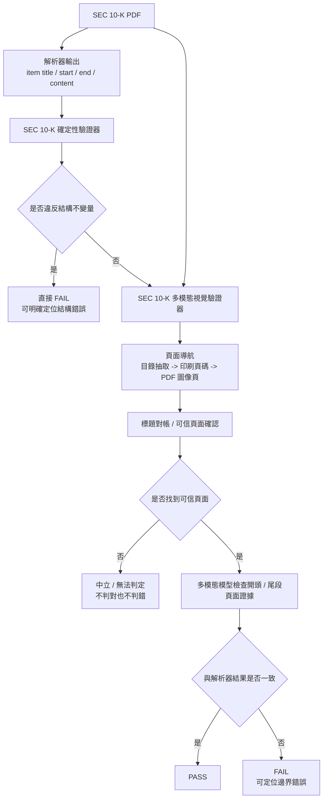

# SEC 10-K 解析器驗證總報告

## 主要結論

提出一套 SEC 10-K 解析器驗證架構，由兩個模組組成：

1. **SEC 10-K 多模態視覺驗證器**
   先用多模態模型自動完成頁面導航，再以頁面證據檢查解析器抽出的 item 前後邊界是否正確。
2. **SEC 10-K 確定性驗證器**
   驗證任何正確解析都必然滿足的結構條件。這些條件一旦被違反，就能直接判定解析器結果存在錯誤。

這兩套方法合起來形成一條完整的驗證閉環：

- 多模態視覺驗證器負責回答「即使結構上沒有明顯矛盾，頁面上的 item 起點與終點是否真的和解析器輸出一致」。
- 確定性驗證器負責回答「這份解析器結果是否違反必然成立的結構不變量」。

目前的核心實驗結論如下：

- **多模態視覺驗證器**
  - 頁面導航階段在 5 份文件、62 個 item 上達到 `56/62 (90.3%)` 完全命中、`60/62 (96.8%)` 落在 `±1 page` 內。
    這表示多模態視覺驗證器已能在大多數 item 上先自動找到正確頁面，並把少數偏差控制在很小的頁碼範圍內。
  - 端到端精確度基線在通過可信頁面確認的子集上達到 `開頭 59/60 (98.3%)`、`尾段 43/44 (97.7%)`。
    這表示在成功導航到可信頁面的前提下，多模態視覺驗證器對正確解析器結果具有很低的誤殺率。
  - 端到端錯誤偵測基線在 4 類錯誤上的偵測率落在 `83.1%–95.3%`。
    這表示多模態視覺驗證器不只會在正確樣本上通過，也能對常見的截斷與越界錯誤提供穩定的偵測能力。
  - 以本次精度最佳模型 `google/gemini-3-flash-preview` 估算，完整跑完一份文件的成本約為 `US$0.022`，折合約 `NT$0.7`，亦即不到 `NT$1`／份。
    這表示即使使用目前表現最好的模型，這套視覺驗證流程的單份驗證成本仍相當低。
- **確定性驗證器**
  - 在 34 份人工標註的 10-K 正確標註資料（Ground Truth）上，4 條規則的誤殺率均為 `0/34 (0.0%)`。
    這表示確定性驗證器在真實正確資料上沒有誤殺，規則本身足夠保守且與資料分布無關。
  - 在 3,760 個系統性注入錯誤樣本上，規則 1、2、4 的偵測率為 `100%`；規則 3 對核心 item 遺失與大段內文遺失的偵測率亦為 `100%`。
    這表示確定性驗證器已能穩定抓出違反必要結構條件的解析器錯誤，特別適合處理區間非法、順序錯亂、重要 item 消失與全文異常過短等問題。

這套驗證架構主要提供：

- 對結構錯誤的**確定性證偽能力**
- 對頁面邊界錯誤的**高信心視覺複查能力**
- 對解析器結果的**可重現、可量化**驗證流程

---

## 1. 驗證總體設計

- **結構型錯誤**
  例如頁面區間非法、item 順序倒退、區間重疊、重要 item 消失、全文內容異常過短。這類錯誤不需要理解頁面語意，只要違反必要條件，就可直接判錯。
- **邊界型錯誤**
  例如 item 開頭抓錯、尾段被截斷、尾端越界讀到下一節、頁面導航偏移。這類錯誤即使整體 JSON 看起來「格式正常」，仍可能需要回到 PDF 頁面做實際驗證。

因此，本報告將解析器驗證拆成兩層：

1. **多模態視覺驗證器**
   用來處理「需要頁面證據」的邊界檢查。
2. **確定性驗證器**
   用來處理「違反即證錯」的必要條件。

### 1.2 閉環流程



---

## 2. SEC 10-K 多模態視覺驗證器

### 2.1 目標與定位

SEC 10-K 多模態視覺驗證器的目標，是建立一條獨立於解析器內容的頁面驗證鏈，回答以下問題：

- 這個 item 應該落在哪一頁？
- 解析器抽出的開頭，是否真的出現在該 item 的開頭頁？
- 解析器抽出的尾端，是否真的停在該 item 的結尾頁，而沒有被截斷或越界？

這個驗證器真正要驗證的是：**當解析器輸出進來後，是否能用視覺證據對 item 邊界做高信心複查（透過多模態模型）。**

### 2.2 方法拆解

多模態視覺驗證器分成兩個階段：

1. **頁面導航（`nav`）**
   用多模態模型從目錄頁（TOC）抽取 `item -> printed page`，再將印刷頁碼對齊到 PDF 圖像頁，最後以 `Item N + title` 在正文頁做標題對帳。
2. **端到端驗證（`e2e`）**
   在頁面導航導出的可信頁面上，將解析器輸出的 `item title / start / end / content` 作為待驗目標，讓多模態模型直接檢查開頭 / 尾段是否與頁面證據一致。具體做法是：
   - `head`（開頭）：讀取重定位後的起始頁，確認解析器抽出的開頭文字是否真的出現在該 item 的起點附近。
   - `tail`（尾段）：不只讀單一結尾頁，而是讀最後 `1–2` 頁；若 item 結尾可能跨頁，模型會同時查看 `end_page-1` 與 `end_page`，確認解析器抽出的尾端是否真的停在下一個章節標題之前。
   - 若頁面證據與解析器內容一致，則判定通過；若頁面證據顯示有截斷、越界或起訖錯置，則判定失敗。

如果頁面導航（`nav`）無法找到可信頁面，系統會輸出：

- **中立 / 無法判定**

多模態視覺驗證器失敗代表證據不足，不代表解析器一定錯。

### 2.3 驗證資料

多模態視覺驗證器目前使用 5 份人工整理（新增 PDF 頁碼對應資訊標註）的基準文件：

- `GDC_2023`
- `NFLX_2025`
- `RELL_2025`
- `TSLA_2023`
- `WMT_2026`

每份資料都包含：

- 原始 `PDF`
- 由 PDF 渲染出的頁面 `PNG`
- item 內容正確標註資料（Ground Truth），例如 `content.json`
- item 頁碼與邊界標註，例如 `pages.json`

這批資料的來源分成兩層：

- **原始來源**：來自本專案整理的 SEC 10-K 基準文件 PDF 與其對應的解析器正確標註資料。
- **驗證標註來源**：在原始解析器正確標註資料之上，額外補上 PDF 頁碼對應、頁面渲染圖、以及 item 的 `start_page / end_page` 對帳結果，形成可供 `nav`、`e2e.run`、`e2e.inject` 共用的評估資料。

這組基準資料的設計目的，主要是讓頁面導航、端到端精確度、端到端錯誤偵測都能在同一批可追查資料上完成評估。

幾個關鍵分母說明：

- `nav` 的總分母是 `62`，代表 5 份文件中納入導航評估的 item 數。
- 端到端精確度先看 `gate`（可信頁面確認），因此會先從 `62` 收斂到成功找到可信頁面的子集；在基線中為 `60/62`。
- `head precision`（開頭精確度）只在通過可信頁面確認的正確樣本子集上計算，因此基線分母為 `60`。
- `tail precision`（尾段精確度）進一步只在可評估尾段的子集上計算，因此基線分母為 `44`。
- 端到端錯誤偵測的分母來自 `gate + clean-pass` 子集，所以不同檢查模型之間可能略有不同。

關於 `tail`，另有一個需要揭露的重點是：**尾段會先做型態分桶**，不是所有 item 都直接進入尾段逐字比對。

- 原因是表格或圖像型尾段常呈現為 HTML 標籤、數字欄位或圖軸標記，逐字比對容易造成假性失敗。
- 因此，只有適合文字比對的尾段會直接納入 tail 驗證，其餘情況則改由下一個 item 的 `head` 覆蓋同一條邊界。
- 這部分在本資料集中的占比很小；真正完全未覆蓋的尾段只有 `1/62 (1.6%)`。

因此，多模態視覺驗證器的所有數字都應解讀為：

- 先有獨立導航
- 再有可信頁面確認
- 最後才在可判定子集上做開頭 / 尾段驗證與錯誤注入測試

### 2.4 模型選型

本節的模型選型主要參考 [bench.md](./external_reference_validation/bench.md) 中整理的多模態模型調查。該表彙整了多個主流多模態模型的公開基準排名，以及價格、上下文長度、速度與首 token 延遲等資訊，作為本研究建立候選池的起點。

在此基礎上，本報告再依下列條件縮小到實際評估模型：

- 可透過目前實驗環境穩定呼叫
- 支援本研究需要的影像輸入
- 成本、速度與可重跑性適合進行 5 份文件的完整比較

#### 頁面導航模型

頁面導航（`nav`）階段固定採用：

- `google/gemini-3-flash-preview`

原因不是單一指標最佳而已，而是頁面導航任務本身較難，包含：

- TOC 頁辨識
- `item -> printed page` 抽取
- `printed page -> render page` 對位
- 標題對帳（heading reconciliation）
- TOC 與正文同名 item 的排除

在這種多步驟導航任務中，穩定性與覆蓋率比單一開頭 / 尾段分數更重要，因此 `nav` 直接固定使用目前最穩定的模型。

#### 邊界檢查模型

`detect` 階段則評估 13 個開源/閉源模型：

- `google/gemini-3-flash-preview`
- `google/gemini-3.1-flash-lite`
- `google/gemini-2.5-pro`
- `google/gemini-2.5-flash`
- `google/gemma-4-31b-it`
- `google/gemma-4-26b-a4b-it`
- `qwen/qwen3.6-plus`
- `qwen/qwen3.6-27b`
- `qwen/qwen3.5-27b`
- `qwen/qwen3.5-122b-a10b`
- `qwen/qwen3.5-35b-a3b`
- `qwen/qwen3.5-9b`
- `moonshotai/kimi-k2.6`

評估分成兩個子任務：

- `e2e.run`：衡量正確樣本精確度 / 誤殺率
- `e2e.inject`：衡量錯誤偵測 / 偵測率

### 2.5 Stage 1：頁面導航覆蓋率

頁面導航（`nav`）在 5 份文件、62 個 item 上的結果如下：

| 文件 | 完全命中 | 落在 `±1 page` 內 |
|---|---:|---:|
| `GDC_2023` | `15/16 (93.8%)` | `16/16 (100.0%)` |
| `NFLX_2025` | `9/11 (81.8%)` | `11/11 (100.0%)` |
| `RELL_2025` | `9/11 (81.8%)` | `10/11 (90.9%)` |
| `TSLA_2023` | `11/12 (91.7%)` | `11/12 (91.7%)` |
| `WMT_2026` | `12/12 (100.0%)` | `12/12 (100.0%)` |
| **合計** | **`56/62 (90.3%)`** | **`60/62 (96.8%)`** |

這代表：

- 頁面導航已能為大多數 item 找到正確頁面。
- 即使未完全命中，絕大多數誤差也落在 `±1 page` 內，足以作為標題對帳的起點。

### 2.6 Stage 2：端到端精確度基線

基線設定：

- `nav-model = google/gemini-3-flash-preview`
- `detect-model = google/gemini-3-flash-preview`

| 文件 | 可信頁面確認 | 開頭精確度 | 尾段精確度 |
|---|---:|---:|---:|
| `GDC_2023` | `16/16 (100.0%)` | `16/16 (100.0%)` | `10/10 (100.0%)` |
| `NFLX_2025` | `11/11 (100.0%)` | `11/11 (100.0%)` | `10/10 (100.0%)` |
| `RELL_2025` | `10/11 (90.9%)` | `9/10 (90.0%)` | `5/6 (83.3%)` |
| `TSLA_2023` | `11/12 (91.7%)` | `11/11 (100.0%)` | `10/10 (100.0%)` |
| `WMT_2026` | `12/12 (100.0%)` | `12/12 (100.0%)` | `8/8 (100.0%)` |
| **合計** | **`60/62 (96.8%)`** | **`59/60 (98.3%)`** | **`43/44 (97.7%)`** |

解讀如下：

- 可信頁面確認 `60/62`，代表只有極少數 item 因證據不足而保持中立。
- 開頭 `59/60` 顯示在可信頁面上，開頭驗證已非常穩定。
- 尾段 `43/44` 已接近開頭水準，顯示把尾段擴成最後 1–2 頁後，原本由跨頁短尾巴造成的假性失敗大幅減少。

### 2.7 Stage 2：13 模型精確度比較

以下表格固定頁面導航模型 `nav-model = google/gemini-3-flash-preview`，比較 13 個檢查模型 `detect-model` 的 `e2e.run` 結果。分母統一以通過可信頁面確認的正確樣本子集計算：

- 開頭分母：`60`
- 尾段分母：`44`

| 排名 | 檢查模型 | 開頭 | 尾段 |
|---|---|---:|---:|
| 1 | `google/gemini-3-flash-preview` | `59/60 (98.3%)` | `43/44 (97.7%)` |
| 2 | `qwen/qwen3.6-plus` | `60/60 (100.0%)` | `40/44 (90.9%)` |
| 3 | `moonshotai/kimi-k2.6` | `57/60 (95.0%)` | `39/44 (88.6%)` |
| 4 | `google/gemini-2.5-pro` | `52/53 (98.1%)` | `33/39 (84.6%)` |
| 5 | `google/gemini-3.1-flash-lite` | `60/60 (100.0%)` | `36/44 (81.8%)` |
| 5 | `qwen/qwen3.5-9b` | `60/60 (100.0%)` | `36/44 (81.8%)` |
| 7 | `qwen/qwen3.6-27b` | `60/60 (100.0%)` | `33/44 (75.0%)` |
| 8 | `qwen/qwen3.5-27b` | `60/60 (100.0%)` | `32/44 (72.7%)` |
| 8 | `qwen/qwen3.5-122b-a10b` | `60/60 (100.0%)` | `32/44 (72.7%)` |
| 10 | `qwen/qwen3.5-35b-a3b` | `58/59 (98.3%)` | `31/43 (72.1%)` |
| 11 | `google/gemma-4-31b-it` | `56/60 (93.3%)` | `29/44 (65.9%)` |
| 11 | `google/gemini-2.5-flash` | `55/57 (96.5%)` | `27/41 (65.9%)` |
| 13 | `google/gemma-4-26b-a4b-it` | `38/49 (77.6%)` | `12/34 (35.3%)` |

這張表的重點說明在相同頁面導航前提下，不同多模態模型在正確樣本邊界驗證上的穩定度差異。

- `google/gemini-3-flash-preview` 在開頭與尾段兩端維持最均衡的結果，因此仍是主要基線。
- `qwen/qwen3.6-plus` 與 `moonshotai/kimi-k2.6` 在 2 頁尾段版本下明顯受益，顯示多頁尾段對跨頁結尾情境確實有效。
- `google/gemini-3.1-flash-lite` 與 `google/gemini-2.5-pro` 仍屬第一梯隊，顯示 Gemini 系列在這個任務上整體較穩。
- 多個 Qwen 模型在開頭精確度幾乎滿分，但尾段精確度仍有明顯分化，表示它們在尾端邊界上的穩定度差異較大。
- `google/gemma-4-26b-a4b-it` 與部分較小模型的尾段明顯偏低，說明在同樣的頁面導航前提下，邊界判讀能力仍有明顯落差。

### 2.8 Stage 3：E2E Detection 基線

基線模型 `google/gemini-3-flash-preview` 的 `e2e.inject` 結果如下：

| operator | `50 lines` | `50%` |
|---|---:|---:|
| `truncate_head` | `53/59 (89.8%)` | `49/59 (83.1%)` |
| `overrun_head` | `55/59 (93.2%)` | `55/59 (93.2%)` |
| `truncate_tail` | `38/43 (88.4%)` | `42/43 (97.7%)` |
| `overrun_tail` | `41/43 (95.3%)` | `38/43 (88.4%)` |

這表示：

- 對開頭類錯誤，多模態視覺驗證器可穩定抓到大多數截斷與越界。
- 對尾段類錯誤，偵測率仍維持在 `88.4%–97.7%`。
- 這些數字是在完整「頁面導航 + 可信頁面確認 + 邊界檢查」流程下取得，而不是直接吃人工指定頁碼。

### 2.9 Stage 3：13 模型錯誤偵測比較

以下表格固定頁面導航模型 `nav-model = google/gemini-3-flash-preview`，比較 13 個檢查模型 `detect-model` 的 `e2e.inject` 結果。

注意：這張表的分母來自各模型自己的「可信頁面確認 + 正確樣本通過」子集，因此模型間分母可能略有不同；這是端到端設計的一部分，不是統計錯誤。

這裡的錯誤注入方法，是直接從正確 item 內容出發，在**開頭 / 尾段窗口**製造四類邊界錯誤，並分成兩種強度：

- **兩種強度**
  - `50lines`：固定截掉或借入 `50` 行；若 item 本身不足 `50` 行，則保留至少 `1` 行，形成接近整段被破壞的情境。
  - `50%`：截掉或借入該 item 一半的行數，模擬比例型的大幅邊界錯誤。
- **開頭錯誤**
  - `truncate_head`：把 item 開頭前 `k` 行直接刪掉，使模型看到的開頭窗口變成後面段落，模擬「開頭截斷」。
  - `overrun_head`：把前一個 item 的最後 `k` 行接到目前 item 開頭，模擬「開頭越界」。
- **尾段錯誤**
  - `truncate_tail`：把 item 結尾最後 `k` 行刪掉，使模型看到的尾段窗口停在更早的段落，模擬「尾段截斷」。
  - `overrun_tail`：把下一個 item 的前 `k` 行接到目前 item 結尾，模擬「尾段越界」。

因此，`e2e.inject` 量測的不是抽象異常分數，而是：當開頭或尾段被實際截掉，或被相鄰 item 內容污染時，多模態視覺驗證器能不能把這些具體邊界錯誤抓出來。

#### 檢查模型錯誤偵測率排行榜

為了讓模型間的錯誤偵測能力更容易比較，以下先將 `truncate_head`、`overrun_head`、`truncate_tail`、`overrun_tail` 四類錯誤，以及 `50 lines` / `50%` 兩種錯誤強度彙整成排行榜。

這裡的「平均偵測率」不是直接平均各格百分比，而是按各模型實際可評估分母加權後計算：

- **開頭錯誤**：彙整 `truncate_head` 與 `overrun_head` 的兩種注入強度。
- **尾段錯誤**：彙整 `truncate_tail` 與 `overrun_tail` 的兩種注入強度。
- **平均偵測率**：彙整開頭錯誤與尾段錯誤的所有可評估樣本。

| 排名 | 檢查模型 | 平均偵測率 | 開頭錯誤 | 尾段錯誤 | 備註 |
|---:|---|---:|---:|---:|---|
| 1 | `google/gemma-4-26b-a4b-it` | `92.5%` | `92.1%` | `93.8%` | 可評估分母較小，需搭配精確度一起看 |
| 2 | `google/gemini-3-flash-preview` | `90.9%` | `89.8%` | `92.4%` | 主要基線模型，精確度與偵測率最均衡 |
| 3 | `qwen/qwen3.5-122b-a10b` | `90.8%` | `90.4%` | `91.4%` | 錯誤偵測表現接近基線 |
| 4 | `google/gemini-2.5-pro` | `90.6%` | `89.9%` | `91.7%` | Gemini 系列第一梯隊 |
| 5 | `google/gemini-3.1-flash-lite` | `90.4%` | `90.0%` | `91.0%` | 偵測穩定，但精確度需分開看 |
| 6 | `qwen/qwen3.6-27b` | `90.3%` | `90.0%` | `90.9%` | 開頭與尾段偵測相對均衡 |
| 7 | `qwen/qwen3.5-35b-a3b` | `89.9%` | `90.5%` | `88.7%` | 開頭錯誤略強於尾段錯誤 |
| 8 | `google/gemini-2.5-flash` | `89.6%` | `89.5%` | `89.8%` | 整體接近 90% |
| 9 | `google/gemma-4-31b-it` | `89.4%` | `90.2%` | `87.9%` | 尾段錯誤略弱 |
| 9 | `qwen/qwen3.5-27b` | `89.4%` | `90.0%` | `88.3%` | 與 Gemma 4 31B 平均相同 |
| 11 | `qwen/qwen3.6-plus` | `89.3%` | `90.0%` | `88.1%` | 精確度較強，但偵測排名較後 |
| 12 | `qwen/qwen3.5-9b` | `88.5%` | `90.0%` | `86.1%` | 尾段錯誤偵測較弱 |
| 13 | `moonshotai/kimi-k2.6` | `87.0%` | `85.5%` | `89.1%` | 尾段偵測高於開頭偵測 |

這張排行榜的解讀重點是：`google/gemini-3-flash-preview` 雖然不是單看偵測平均的第一名，但它同時具有最高精確度、穩定的頁面導航、以及均衡的錯誤偵測率，因此仍是目前最適合作為整體多模態視覺驗證器基線的模型。相對地，`google/gemma-4-26b-a4b-it` 的偵測平均最高，但正確樣本精確度分母與表現較弱，不能單獨解讀為最佳模型。

#### 四類錯誤明細

| 檢查模型 | `truncate_head` | `overrun_head` | `truncate_tail` | `overrun_tail` |
|---|---|---|---|---|
| `google/gemini-3-flash-preview` | `53/59 (89.8%)` / `49/59 (83.1%)` | `55/59 (93.2%)` / `55/59 (93.2%)` | `38/43 (88.4%)` / `42/43 (97.7%)` | `41/43 (95.3%)` / `38/43 (88.4%)` |
| `google/gemini-3.1-flash-lite` | `54/60 (90.0%)` / `50/60 (83.3%)` | `56/60 (93.3%)` / `56/60 (93.3%)` | `31/36 (86.1%)` / `35/36 (97.2%)` | `34/36 (94.4%)` / `31/36 (86.1%)` |
| `google/gemini-2.5-pro` | `47/52 (90.4%)` / `44/52 (84.6%)` | `48/52 (92.3%)` / `48/52 (92.3%)` | `28/33 (84.8%)` / `32/33 (97.0%)` | `32/33 (97.0%)` / `29/33 (87.9%)` |
| `google/gemini-2.5-flash` | `49/55 (89.1%)` / `46/55 (83.6%)` | `51/55 (92.7%)` / `51/55 (92.7%)` | `24/27 (88.9%)` / `27/27 (100.0%)` | `25/27 (92.6%)` / `21/27 (77.8%)` |
| `google/gemma-4-31b-it` | `50/56 (89.3%)` / `46/56 (82.1%)` | `53/56 (94.6%)` / `53/56 (94.6%)` | `24/29 (82.8%)` / `28/29 (96.6%)` | `26/29 (89.7%)` / `24/29 (82.8%)` |
| `google/gemma-4-26b-a4b-it` | `34/38 (89.5%)` / `32/38 (84.2%)` | `37/38 (97.4%)` / `37/38 (97.4%)` | `9/12 (75.0%)` / `12/12 (100.0%)` | `12/12 (100.0%)` / `12/12 (100.0%)` |
| `qwen/qwen3.6-plus` | `54/60 (90.0%)` / `50/60 (83.3%)` | `56/60 (93.3%)` / `56/60 (93.3%)` | `30/40 (75.0%)` / `39/40 (97.5%)` | `38/40 (95.0%)` / `34/40 (85.0%)` |
| `qwen/qwen3.6-27b` | `54/60 (90.0%)` / `50/60 (83.3%)` | `56/60 (93.3%)` / `56/60 (93.3%)` | `29/33 (87.9%)` / `33/33 (100.0%)` | `31/33 (93.9%)` / `27/33 (81.8%)` |
| `qwen/qwen3.5-27b` | `53/60 (88.3%)` / `51/60 (85.0%)` | `56/60 (93.3%)` / `56/60 (93.3%)` | `27/32 (84.4%)` / `30/32 (93.8%)` | `29/32 (90.6%)` / `27/32 (84.4%)` |
| `qwen/qwen3.5-122b-a10b` | `54/60 (90.0%)` / `51/60 (85.0%)` | `56/60 (93.3%)` / `56/60 (93.3%)` | `27/32 (84.4%)` / `32/32 (100.0%)` | `30/32 (93.8%)` / `28/32 (87.5%)` |
| `qwen/qwen3.5-35b-a3b` | `52/58 (89.7%)` / `51/58 (87.9%)` | `53/58 (91.4%)` / `54/58 (93.1%)` | `27/31 (87.1%)` / `30/31 (96.8%)` | `28/31 (90.3%)` / `25/31 (80.6%)` |
| `qwen/qwen3.5-9b` | `53/60 (88.3%)` / `52/60 (86.7%)` | `55/60 (91.7%)` / `56/60 (93.3%)` | `25/36 (69.4%)` / `34/36 (94.4%)` | `34/36 (94.4%)` / `31/36 (86.1%)` |
| `moonshotai/kimi-k2.6` | `47/57 (82.5%)` / `42/57 (73.7%)` | `53/57 (93.0%)` / `53/57 (93.0%)` | `31/39 (79.5%)` / `38/39 (97.4%)` | `37/39 (94.9%)` / `33/39 (84.6%)` |

這張表的重點在於：即使同樣通過「頁面導航 + 可信頁面確認」，不同檢查模型對「錯誤邊界」的敏感度仍有顯著差異。

- `google/gemini-3-flash-preview` 在四類錯誤上維持最均衡的偵測率，因此仍適合作為整體視覺驗證方案的主要基線。
- `google/gemini-3.1-flash-lite`、`google/gemini-2.5-pro` 在多數錯誤類型上與主基線接近，顯示 Gemini 系列不只精確度穩，對錯誤邊界也有不錯的偵測率。
- `qwen/qwen3.6-plus` 與 `moonshotai/kimi-k2.6` 在 2 頁尾段設定下的尾段偵測有明顯改善，說明多頁尾段對跨頁結尾情境確實有效。
- Qwen 系列在部分尾段截斷 / 尾段越界任務上表現突出，但整體波動仍較大，表示它們對某些錯誤型態特別敏感，卻未必在四類錯誤上都同樣穩定。
- `google/gemma-4-31b-it` 在部分尾段任務上仍具競爭力，但開頭截斷與整體平衡性仍弱於第一梯隊。

因此，這張表更適合被解讀為「不同模型對不同錯誤型態的敏感度輪廓」，而不只是單一總分排名。

---

## 3. SEC 10-K 確定性驗證器

### 3.1 目標與定位

SEC 10-K 確定性驗證器的目標，是驗證任何正確解析都必然滿足的條件。它不依賴語言模型、不依賴語料統計分布，也不以「大多數文件通常長這樣」作為判準。

它回答的問題是：

- 解析器結果是否違反了基本的頁面區間幾何約束？
- 解析器結果是否破壞了 SEC 10-K item 的必要順序？
- 解析器是否遺漏了本應存在的重要 item？
- 解析器是否其實抽到錯文件、空內容、或明顯不完整的內容？

這種方法的優勢是：

- 若規則成立，錯誤可以被明確定位。
- 若規則違反，判錯依據清楚，不依賴模型主觀判讀。
- 執行成本極低，適合作為解析器驗證第一道防線。

### 3.2 驗證資料

確定性驗證器使用兩層資料：

1. **34 份正確標註資料（Ground Truth）**
   來自人工整理的 10-K 標註資料，用來量誤殺率，也就是在正確資料上是否誤殺。
2. **3,760 個注入錯誤樣本（mutants）**
   從上述正確標註資料系統性生成，用來量偵測率，也就是面對已知錯誤時能否抓到。

資料來源同樣分成兩層：

- **原始來源**：本專案整理的 SEC 10-K 解析器正確標註資料，包含每份文件的 item 結構、頁碼區間與內容文字。
- **驗證來源**：以這 34 份正確標註資料為母體，透過程式化錯誤注入（mutation）產生 `3,760` 個錯誤樣本，用來對四條規則做系統性對抗測試。

正確標註資料（Ground Truth）的覆蓋範圍包含：

- 2016–2026 年
- 12 家公司
- 多種 filer 規模
- iXBRL 與較舊 HTML
- Part III incorporated by reference
- 超過 400 頁的大型文件

注入錯誤樣本則對應到四條規則的主要錯誤型態，例如：

- 非法區間
- 順序倒退或頁碼重疊
- 重要 item 消失
- 內容大幅縮水或接近空檔

因此，確定性驗證器的數字要分成兩種解讀：

- `0/34` 類型的結果，代表在真實正確資料上的誤殺率
- `100%` 類型的結果，代表在人工注入錯誤資料上的偵測率

### 3.3 四條核心規則

| 規則 | 檢查內容 | 核心意義 | 誤殺率 | 偵測能力 |
|---|---|---|---:|---:|
| 規則 1：區間合法性 | `0 <= start < end` | 防止零長度、反向區間、負頁碼 | `0/34` | `100%` |
| 規則 2：單調且不可重疊 | 後續 item 的 `start` 不得早於前一 item 的 `end` | 防止順序倒退與頁面重疊 | `0/34` | `100%` |
| 規則 3：重要 item 不可消失 | SEC 10-K 重要 item 應在抽取結果中存在 | 防止解析器大段漏抓或整節消失 | `0/34` | `100%`（核心 item / 大段遺失） |
| 規則 4：全文內容底線 | 抽取總內容不得低於保守下限 | 防止錯文件、空抽取、嚴重截斷 | `0/34` | `100%` |

### 3.4 驗證資料與對抗式測試

確定性驗證器的可信度來自四個層面的證據：

1. **規則本身是必要條件，而不是語料統計**
   這些規則不依賴某家公司、某年度、某種版型，而是來自解析器結果若要正確，必然滿足的結構性約束。
2. **在 34 份真實正確標註資料上沒有誤殺**
   評估集涵蓋 2016–2026、12 家公司、多種 filer 規模、iXBRL、新舊 HTML、Part III by reference，以及超過 400 頁的大型文件。
3. **以系統性錯誤注入驗證偵測率**
   從 34 份正確標註資料生成 `3,760` 個注入錯誤樣本，並且一次只注入**單一類別錯誤**，避免多種錯誤互相干擾。注入方法如下：
   - **規則 1：區間合法性**
     對每個有 `char_range` 的 item，分別產生三種不可能區間：`reverse`（把 `(start, end)` 反轉成 `(end, start)`）、`zero`（改成零長度 `(start, start)`）、`neg_start`（把起點改成 `-1`）。
   - **規則 2：單調且不可重疊**
     對相鄰 item 的區間做三種順序破壞：`swap`（交換相鄰兩個 item 的區間）、`overlap`（把前一個 item 延長到吃進下一個 item 的起點之後）、`displace`（把某個 item 的區間搬到文件最前面，製造非單調順序）。
   - **規則 3：重要 item 不可消失**
     使用 `omit_item` 直接刪除某個 item 的輸出，模擬解析器完全漏抓該章節；鄰近 item 的區間保持不動，因此原本該 item 佔據的文字會變成無人認領的空隙。
   - **規則 4：全文內容底線**
     使用 `gut` 清空所有 `extracted item` 的內容，模擬錯文件或近乎空抽取；使用 `keep_one` 只保留一個極短 item、其餘內容清空，模擬只解析到封面或極少量正文。
   這些 operator 都是直接從正確 Ground Truth 複製後再做最小破壞，因此可以精準回答：當特定類型的解析錯誤發生時，規則是否能把它抓出來。
4. **門檻設得保守**
   例如規則 3 的間隔門檻（gap threshold）設為 `1,000 chars`，而資料中實際最大正常 gap 僅 `413 chars`；規則 4 的全文底線設為 `5,000 chars`，而最短真實文件仍有 `153,052 chars`。

### 3.5 結果說明

這組結果代表：

- 確定性驗證器不是在「猜哪種文件看起來像異常」。
- 它是在檢查解析器結果是否違反了不應被違反的硬性約束。
- 因此，只要命中規則違反，就具有非常高的可解釋性與可操作性。

它的邊界也很清楚：

- 若解析器在結構上仍自洽，但頁面邊界抓得不準，確定性驗證器未必能發現。
- 這類更細粒度的邊界錯誤，就是多模態視覺驗證器要補上的部分。

---

## 4. 方案配置總結

### 4.1 驗證方案組成

- **結構層**
  使用 SEC 10-K 確定性驗證器，檢查解析器結果是否違反必要結構條件。
- **頁面層**
  使用 SEC 10-K 多模態視覺驗證器，透過「頁面導航 + 端到端驗證」在 PDF 頁面上複查 item 邊界。

### 4.2 多模態視覺驗證器實驗配置

#### 頁面導航

- 本報告固定使用 `google/gemini-3-flash-preview`

#### 邊界檢查

- 本報告在相同 `nav-model` 下，對 13 個檢查模型（detect model）做並列比較。
- `google/gemini-3-flash-preview` 作為主要基線，是因為它在本次基準資料上同時取得最佳整體精確度與穩定的偵測結果。
- 其餘表現較強的模型包括：
  - `google/gemini-3.1-flash-lite`
- `google/gemini-2.5-pro`
  - `qwen/qwen3.6-plus`

就這份報告的目的而言，這些結果主要用來說明：

- 頁面導航覆蓋率最佳且最穩定
- 端到端精確度在 13 模型中最佳
- 端到端錯誤偵測維持高而均衡的表現

---

## 5. 邊界與限制

### 5.1 確定性驗證器的限制

- 它只驗證必要條件，不直接保證頁面語意邊界百分之百正確。
- 若解析器在結構上完全自洽，但某個 item 的開頭 / 尾段抓錯，仍需要多模態視覺驗證器補充。

### 5.2 多模態視覺驗證器的限制

- 頁面導航（`nav`）尚未達到 `100%` 完全命中覆蓋率。
- 可信頁面確認（`gate`）失敗時系統會保持中立，因此不是所有 item 都會得到 PASS/FAIL。
- 尾段（`tail`）任務天生比開頭（`head`）更難，尤其在跨頁尾巴、同頁換節、頁首短尾段等情境下。
- `e2e.inject` 的分母會依「可信頁面確認 + 正確樣本通過」子集變化，因此不同檢查模型的分母不完全一致。
- 目前基準資料為 5 份文件，雖然涵蓋多種版型，但仍非完整 SEC 10-K 母體。

---

## 6. 可重現性與檔案入口

### 6.1 主要程式

- 多模態視覺驗證器
  - [toc_extract.py](./external_reference_validation/toc_nav/toc_extract.py)
  - [coverage.py](./external_reference_validation/toc_nav/coverage.py)
  - [run.py](./external_reference_validation/e2e/run.py)
  - [inject.py](./external_reference_validation/e2e/inject.py)
- 確定性驗證器
  - [model.py](./deterministic_validation/model.py)
  - [rules.py](./deterministic_validation/rules.py)
  - [mutations.py](./deterministic_validation/mutations.py)
  - [runner.py](./deterministic_validation/runner.py)

### 6.2 重跑指令

#### 多模態視覺驗證器：頁面導航

```bash
python -m feedback.external_reference_validation.toc_nav.toc_extract --label GDC_2023
python -m feedback.external_reference_validation.toc_nav.coverage --model google/gemini-3-flash-preview
```

#### 多模態視覺驗證器：端到端精確度

```bash
python -m feedback.external_reference_validation.e2e.run --label GDC_2023 --nav-model google/gemini-3-flash-preview --detect-model google/gemini-3-flash-preview --batch 4
```

#### 多模態視覺驗證器：端到端錯誤偵測

```bash
python -m feedback.external_reference_validation.e2e.inject --nav-model google/gemini-3-flash-preview --detect-model google/gemini-3-flash-preview --batch 4
```

#### 確定性驗證器

```bash
python -m feedback.deterministic_validation.runner
python -m feedback.deterministic_validation.runner --dump
```
